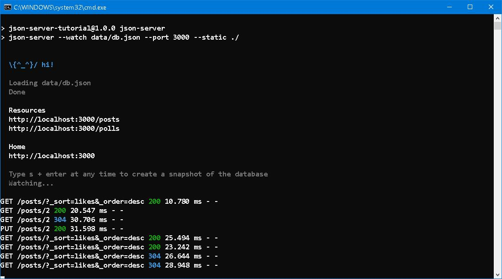
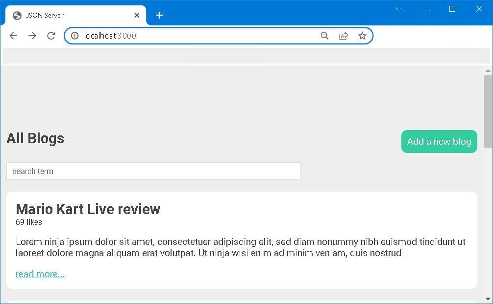

# Simplicity but not simple

[](https://www.youtube.com/watch?v=FZ7qdTV4ouo)

## Forward
It was a hot day after mid-autumn. The whole city was enshrouded by moan and deadly pain. Every pores were blocked with dirt, respiratory was scarcely possible. Stalking through the dust, I managed to reach the station and get ready for return carriage. Neither stars nor crescent presented in the firmament. 

## I. To prepare
> Get a full fake REST API with zero coding in less than 30 seconds (seriously)
```bash
npm install json-server --save-dev
```
if you prefer dynamic generated json data, you need two more packages
```bash 
npm install lodash --save-dev
npm install @faker-js/faker --save-dev
```
package.json
```json
{
  "name": "json-server-tutorial",
  "version": "1.0.0",
  "description": "",
  "main": "index.js",
  "scripts": {
    "json-server": "json-server data/db.json --watch --port 3000 --static ./",
    "json-dynamic": "json-server js/generate.js --port 3000 --static ./"
  },
  "keywords": [],
  "author": "",
  "license": "ISC",
  "devDependencies": {
    "@faker-js/faker": "^7.5.0",
    "json-server": "^0.17.0",
    "lodash": "^4.17.21"
  }
}
```

```bash 
json-server [options] <source>

Options:
  --config, -c       Path to config file           [default: "json-server.json"]
  --port, -p         Set port                                    [default: 3000]
  --host, -H         Set host                             [default: "localhost"]
  --watch, -w        Watch file(s)                                     [boolean]
  --routes, -r       Path to routes file
  --middlewares, -m  Paths to middleware files                           [array]
  --static, -s       Set static files directory
  --read-only, --ro  Allow only GET requests                           [boolean]
  --no-cors, --nc    Disable Cross-Origin Resource Sharing             [boolean]
  --no-gzip, --ng    Disable GZIP Content-Encoding                     [boolean]
  --snapshots, -S    Set snapshots directory                      [default: "."]
  --delay, -d        Add delay to responses (ms)
  --id, -i           Set database id property (e.g. _id)         [default: "id"]
  --foreignKeySuffix, --fks  Set foreign key suffix, (e.g. _id as in post_id)
                                                                 [default: "Id"]
  --quiet, -q        Suppress log messages from output                 [boolean]
  --help, -h         Show help                                         [boolean]
  --version, -v      Show version number                               [boolean]

Examples:
  json-server db.json
  json-server file.js
  json-server http://example.com/db.json
```
generate.js
```javascript
module.exports = () => {
    const { faker } = require("@faker-js/faker")
    const _ = require("lodash")

    return { posts: _.times(100, function(n) {
                return {
                    id: n, 
                    title: faker.hacker.phrase(),
                    body: faker.lorem.paragraph(),
                    likes: Math.round(Math.random() * 50)
                } 
        })
    }
}
```


## II. To put in work 
```bash
npm run json-server
```
or 
```bash
npm run json-dynamic
```



## III. To Round up
- Navigate to <code>http://localhost:3000</code>, or 

- Right-click on <code>index.html</code> and choose <code>Open with [Live Server](https://marketplace.visualstudio.com/items?itemName=ritwickdey.LiveServer)</code> in <code>[VSCode](https://code.visualstudio.com/)</code>

Either way will work as expected. 




## IV. Reference
1. [Up & Running with JSON Server (Part 1)](https://www.youtube.com/watch?v=mAqYJF-yxO8)
2. [Up & Running with JSON Server (Part 2)](https://www.youtube.com/watch?v=VF3TI4Pj_kM)
3. [typicode/json-server](https://github.com/typicode/json-server)
4. [Web APIs - MDN Web Docs | Document.querySelector()](https://developer.mozilla.org/en-US/docs/Web/API/Document/querySelector)
5. [Web APIs - MDN Web Docs | Window.location](https://developer.mozilla.org/en-US/docs/Web/API/Window/location)
6. [Web APIs - MDN Web Docs | URLSearchParams](https://developer.mozilla.org/en-US/docs/Web/API/URLSearchParams)
7. [Web APIs - MDN Web Docs | Fetch API](https://developer.mozilla.org/en-US/docs/Web/API/Fetch_API)
8. [Creating Demo APIs with json-server](https://egghead.io/lessons/javascript-creating-demo-apis-with-json-server)
9. [npm | lodash](https://www.npmjs.com/package/lodash)
10. [npm | @faker-js/faker](https://www.npmjs.com/package/@faker-js/faker)
11. [My JSON Server](https://github.com/Albert0i/myrepo)
12. [The Unparalleled Adventure of One Hans Pfaall](https://poemuseum.org/the-unparalleled-adventure-of-one-hans-pfaall/)


## EOF (2022/09/20)